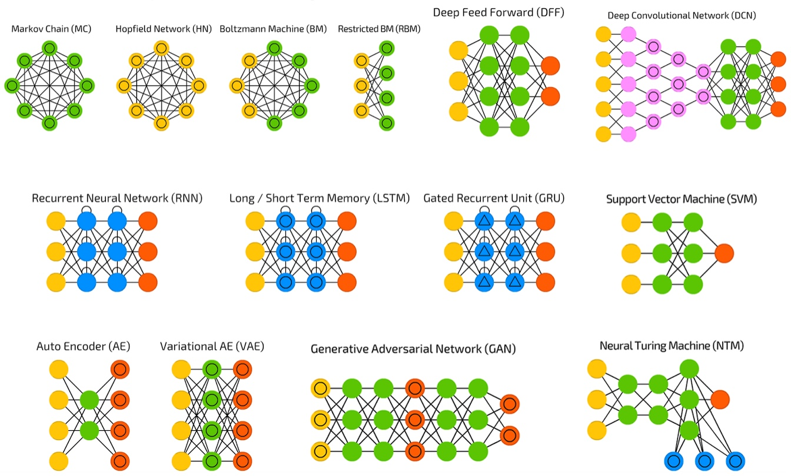
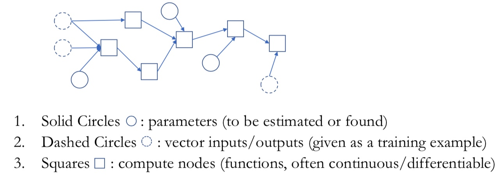
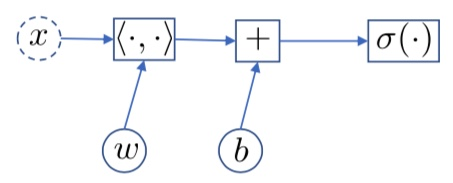

`가설집합(Hypothesis Set)`이란, 어떠한 문제가 주어졌을 때 문제를 해결하기 위한 알고리즘, 즉 **모델 아키텍쳐**를의미하며 문자 $\mathcal{H}$로 표현합니다. 모델 아키텍쳐는 **Graph**라고 부르기도 하며,  **하이퍼 파라미터**($\theta$)에 따라 무수히 많이 생성될 수 있습니다. 하이퍼 파라미터는 레이어의 개수, 각 레이어를 구성하는 노드의 개수, 최적화 방법, 배치 사이즈 등 많은 파라미터로 구성되어 있습니다. 아래 그림은 수많은 그래프들의 예시입니다.

### Neural Network
인공 신경망이란, `비순환 그래프(DAG, an Directed Acyclic Graph)`라고 할 수 있습니다. 이러한 인공신경망 모델, 즉 가설집합을 구성하는 모델의 아키텍쳐는 파라미터, Input/Output 벡터, 계산 노드로 구성되어 있으며, 각각의 모듈이 순차적으로 진행되는 `단방향 성질(Forward Computation)`을 가지고 있습니다. 

그 예로, 데이터를 분류(Classification)하기 위한 알고리즘인 Logistic Regression는 다음과 같은 수식으로 구성됩니다.

$$ p_\theta(y = 1|x) = \sigma(w^Tx+b) = \frac{1}{1+\exp(-w^Tx-b)}$$

이는 아래와 같은 그래프로 표현할 수 있습니다. Dash Circle $x$는 Input Vector이고, Square는 계산 노드입니다. 1)$x$ input vector가 주어지고 2) $<\cdot, \cdot>$ Square에서 가중치와 연산 3) Bias($b$) 덧셈 4) 시그모이드 함수를 통해 최종 결과를 산출하는 과정을 도식화 한 것입니다. 

 

### Object-oriented Paradigm
앞서 설명한 각 아키텍쳐 생성 단계를 모듈화하여, Tensorflow, Pytorch 등과 같은 프레임워크에서 엔터만 눌러주면 자동적으로 결과를 산출할 수 있게 됩니다. 이러한 구조를 `객체 지향 패러다임(Object-oriented Paradigm)`이라고 하며, 이는 코드의 **재사용성(reusability)**을 높게 해주어 여러 문제에 적용할 수 있다는 장점이 있습니다. 

## Keyword
`가설집합(Hypothesis Set)` `하이퍼파라미터(Hyperparameter)` `네트워크 아키텍쳐(Network Architecture)` `가중치 매개변수(Weight Parameter)` `비순환 그래프(An Arbitrary Directed Acyclic Graph)` `인공신경망(Neural Network)` `객체 지향 패러다임(Object-oriented Paradigm)`

## References

**Machine Learning for NLP**의 모든 포스팅은 뉴욕대 조경현 교수님의 '딥러닝을 이용한 자연어 처리' MOOC 강의를 정리한 것입니다. (https://www.edwith.org/deepnlp/joinLectures/17363)
